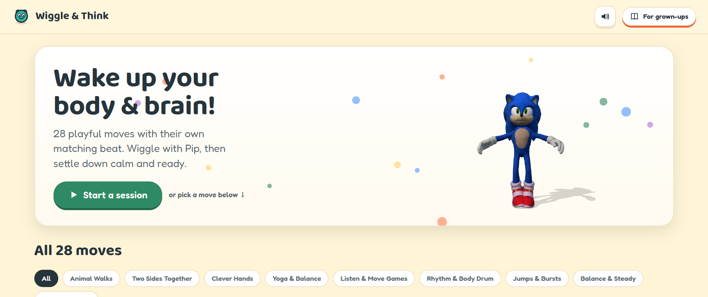

# Wiggle & Think

Movement breaks for children aged 4 to 7, in the browser. Free, no account, no ads,
nothing to install.

Live at **[play.mwmai.no](https://play.mwmai.no)**.



Twenty-eight moves, each with its own beat, its own animated demonstration and a step by
step pose breakdown. Press "Start a session" for a guided nine-move run that warms up,
gets loud, then settles back down. Or tap any single move and do that one.

## The moves

| Group | Moves |
|---|---|
| Animal Walks | Bear Crawl, Crab Walk, Inchworm |
| Two Sides Together | Cross-Crawl March, Windmill Toe-Touch, Two Beaks Talking |
| Yoga & Balance | Tree Pose, Airplane Pose, Cat-Cow, Downward Dog |
| Balance & Steady | Flamingo Hop, Tightrope Walk |
| Listen & Move Games | Freeze Dance, Clap & Echo |
| Rhythm & Body Drum | Body Drum, Piano Fingers |
| Jumps & Bursts | Kangaroo Jumps, Star Jumps, Jumping Jacks |
| Clever Hands | Palm & Beak, Fist & Palm, Point & Palm, Peace & Palm, Beak & Fist, Fist & Flat Swap, Finger Counting, Rock Paper Scissors |
| Calm & Breathe | Starfish Breathing |

The Clever Hands moves are the finger and coordination drills: each one is shown on a real
rigged 3D hand so a child can see exactly which finger goes where, which a flat drawing
cannot do.

## Honest about the science

There is a "For grown-ups" page, and it is deliberately unexciting. The site claims only
what the research actually supports:

- Movement that also demands attention and rule-following does more for focus and
  self-control than running around alone.
- Keeping a steady beat is linked to the sound skills underneath early reading.
- Jumping builds bone density. That is the strongest claim on the page.
- A short movement burst measurably improves attention for a while afterwards.

It does not claim hemisphere balancing, Brain Gym, or that any of this raises a test
score. The two source briefs the content was written from live in `src/_research/`.

## How it is built

Plain React (the production UMD build, self-hosted), JSX transpiled ahead of time, no
bundler and no framework beyond that. The page ships under a strict Content Security
Policy with `script-src 'self'` and no `unsafe-eval`, which is why the JSX is transpiled
at build time rather than in the browser.

```
src/
  index.html              shell
  assets/
    data.js               the 28 moves, session order, tempo bands, phases
    pip.js                Pip, the articulated SVG mascot (biped, quadruped and crab rigs)
    sonic3d.js            3D character rig: poses a skeleton from baked animation clips
    hands3d.js            3D hands for the Clever Hands moves, rigged 69-bone glTF
    audio.js              Web Audio beat engine plus per-move sound effects
    anim.css / char.css   per-move keyframes, rig pivots, blink, breathing belly
    app.css               site styling
    vendor/               React and Three.js, self-hosted
  _research/              the two source research briefs
build.mjs                 JSX to JS, copies vendor and models, writes dist/
verify.mjs                headless render of dist/ with console-error capture
live-verify.mjs           the same check against the live domain
```

Both 3D rigs share **one** offscreen WebGL renderer that draws into plain 2D canvases.
Browsers cap live WebGL contexts at around sixteen, and the move grid alone wants
twenty-eight, so the player stage animates live while every card and thumbnail gets a
single rendered frame.

```bash
npm install
node build.mjs     # writes dist/
node verify.mjs    # headless render plus screenshots plus error capture
```

Deploying is an rsync of `dist/` to any static host:

```bash
rsync -az --delete dist/ user@your-server:/var/www/play/
```

One serving note: glTF textures are decoded through a blob URL, so the host's CSP needs
`blob:` in `connect-src`, `img-src` and `worker-src`. Without it the models load but
render black.

## Editing it later

[`HOW_TO_ADJUST.md`](HOW_TO_ADJUST.md) is the plain-language guide: how to change a move's
wording, its tempo, its animation or its sound without reading the whole codebase.
[`tools/`](tools/) holds the 3D pipeline notes, including how a new character animation
gets baked and wired in.

## Credits

Music is Kevin MacLeod (CC BY 4.0), Mixkit and OpenGameArt (CC0). Full list in
[CREDITS.md](CREDITS.md). Sound effects are synthesised in the browser, so there are no
audio files to license.

The 3D character model in the hero and on most move cards is third-party fan-model
content and is not covered by this repository's licence. The project's own code is MIT.

## Licence

MIT for the code in this repository. Third-party models, music and fonts keep their own
licences, listed above.
